# 《余电》独立美术参考素材归档

修订：art-reference-r1｜2026-10-03。

本目录只放美术参考，不包含研发路线、版本工期或 GLM 工作安排。原合成稿中自动生成的时间表和能力描述不作为研发依据。

## 本批是什么

这是所有者认可合成稿的**逐项拆分归档**，不是新生成的高清单体。GitHub 内有 27 张独立 WebP 参考图：4 张环境场景、8 张设施、4 张机器人外形、5 张状态与 6 张地表前后图；另有 12 份真实 SVG 外轮廓参考。每个文件可单独打开与讨论。

来源原图：`a_large_infographic_concept_art_and_roadmap_post.png`，1312×1199；SHA-256：`45a03cc29c21c440a3da696ca804538d50788f10b5580521b9fad794aaf55f90`。它是对话中的已认可生成稿，不是游戏截图。

**多数单位/设施仅约 70–150 像素宽；不会通过放大、改扩展名或 AI 补像素冒充已完成的高清素材。** WebP 是保留原尺寸的有损预览，逐项质量和来源坐标见 [asset-index.csv](asset-index.csv)。随本次对话交付的独立素材 ZIP 另含 28 张原像素 PNG（多一张顶部总览）、完整 manifest 与相同 SVG；PNG 不经过有损 WebP 再导出。

本目录没有游戏模型、材质、动画、碰撞、LOD、生产贴图或完整转面。后续应在本方向下制作独立高清设计图与少量真实三维样件，不把这里的小图直接批量投产。

## 文件格式

- 渲染感场景/单体参考用 PNG 或 WebP。SVG 不会恢复已经缺失的细节；不将位图嵌入 SVG 来伪装矢量。
- `svg-silhouettes/` 只含可编辑路径的单色外轮廓，透明背景，无内嵌位图、字体、脚本或外链；用于辨识度与图标外形研究，不等于原彩色图的矢量版本。
- 真实三维资源另以模型、材质和动画交付。Godot 官方推荐 glTF 2.0 的三维交换路径；图像与模型不是同一种资产。

格式依据：[Godot 图像导入](https://docs.godotengine.org/en/stable/tutorials/assets_pipeline/importing_images.html)、[三维导入格式](https://docs.godotengine.org/en/stable/tutorials/assets_pipeline/importing_3d_scenes/available_formats.html)。

## 设计范围不从图中反推

四张机器人外形中，采掘与清场是筑垒的外形/工具候选，不因此新增第四个已批准机器人组。指挥设施的穹顶不批准人口城市；能源模块外形不自动合并储能和充电规则。图中的烟、灯色不规定失效原因，回收姿态不是牵引连接已经完成的证据。

地表前后图用于讨论意图，不是几何、碰撞、导航和保存已实现的证据。技术验收继续依据现役产品文档。

## 场景

| 白昼 | 黄昏 | 夜间 | 沙尘暴 |
|---|---|---|---|
| [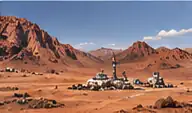](scenes/scene-02-daylight.webp) | [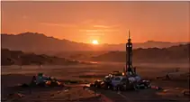](scenes/scene-03-sunset.webp) |  | [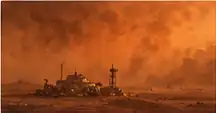](scenes/scene-05-dust-storm.webp) |

## 设施

| 参考 | 独立图片 | SVG 单色轮廓 |
|---|---|---|
| 指挥设施外形 | [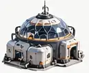](facilities/facility-01-command.webp) | [SVG](svg-silhouettes/facility-01-command-silhouette.svg) |
| 太阳能阵列 | [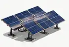](facilities/facility-02-solar-array.webp) | [SVG](svg-silhouettes/facility-02-solar-array-silhouette.svg) |
| 储能补能模块外形 |  | [SVG](svg-silhouettes/facility-03-energy-module-silhouette.svg) |
| 加工设施 | [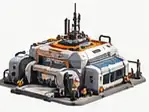](facilities/facility-04-processing.webp) | [SVG](svg-silhouettes/facility-04-processing-silhouette.svg) |
| 采矿作业区 | [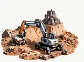](facilities/facility-05-mining-site.webp) | [SVG](svg-silhouettes/facility-05-mining-site-silhouette.svg) |
| 仓储设施 | [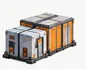](facilities/facility-06-warehouse.webp) | [SVG](svg-silhouettes/facility-06-warehouse-silhouette.svg) |
| 维修设施 |  | [SVG](svg-silhouettes/facility-07-maintenance-silhouette.svg) |
| 着陆平台外形 | [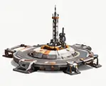](facilities/facility-08-landing-pad.webp) | [SVG](svg-silhouettes/facility-08-landing-pad-silhouette.svg) |

## 机器人外形

| 参考 | 独立图片 | SVG 单色轮廓 |
|---|---|---|
| 驮运 | [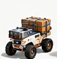](units/unit-01-hauler.webp) | [SVG](svg-silhouettes/unit-01-hauler-silhouette.svg) |
| 筑垒采掘外形候选 | [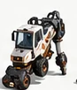](units/unit-02-builder-mining.webp) | [SVG](svg-silhouettes/unit-02-builder-mining-silhouette.svg) |
| 筑垒清场外形候选 | [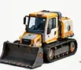](units/unit-03-builder-earthworks.webp) | [SVG](svg-silhouettes/unit-03-builder-earthworks-silhouette.svg) |
| 望山 |  | [SVG](svg-silhouettes/unit-04-surveyor-silhouette.svg) |

## 运行与故障状态

| 正常工作示意 | 低电回充示意 | 零电停机示意 | 机械故障示意 | 被回收示意 |
|---|---|---|---|---|
| [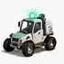](states/state-01-working.webp) | [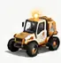](states/state-02-returning.webp) |  |  | [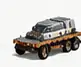](states/state-05-recovery.webp) |

## 地表前后变化

| 场景 | 改造前 | 改造后 |
|---|---|---|
| 坡地整平 | [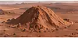](terrain/terrain-01-slope-before.webp) | [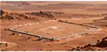](terrain/terrain-02-slope-after.webp) |
| 矿点开挖 | [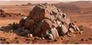](terrain/terrain-03-mine-before.webp) | [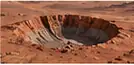](terrain/terrain-04-mine-after.webp) |
| 设施建设 | [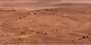](terrain/terrain-05-site-before.webp) | [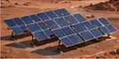](terrain/terrain-06-site-after.webp) |

## 后续逐项迭代

优先补白昼基地总览、驮运/筑垒/望山独立视图、太阳能/加工/补能维修设施，以及同镜头地形改造前后。分别记录镜头、比例、材质、锚点、状态和批准范围。场景图不夹带研发文字，技术规划不以图片作为执行合同。

本批只完成拆图、轮廓提取与文件校验；未进行新的图像生成、三维建模、Mac 实机或真人可玩性验证。
