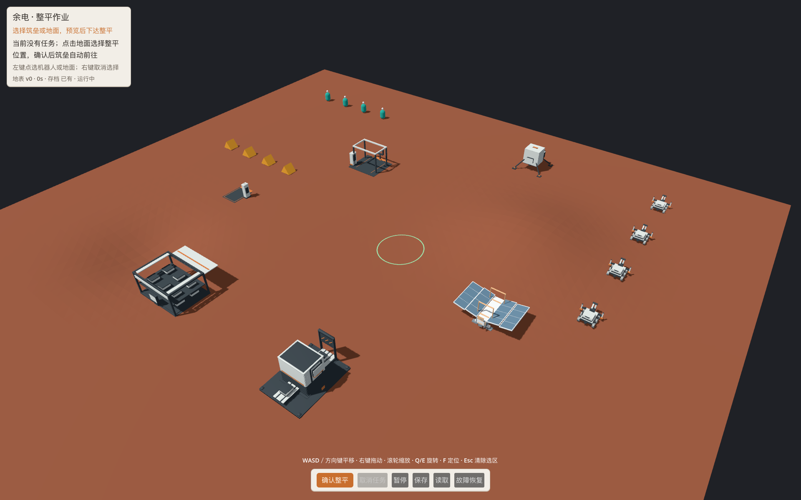

# 实际玩家场景的默认镜头 · 2026-10-07

**建议保留normal方向与50° FOV，距离拉远1.6倍；工程主控已决定在运行Main应用此倍率，canonical camera.json保留。** 正常操作时六设施与四筑垒都可见，筑垒比既有overview大约25%，滚轮仍使用工程现有近远缩放。

机器输入：[camera-player.json](../../../../art/d1/camera-player.json)。原焦点(4,0,-2.5)不动；新position=(25.12,28.8,26.3)，FOV50、perspective/keep_height、near=.05/far=200，距焦点45.8796m。只把旧position-target向量乘1.6，不改变模型或游戏坐标。

| 实际Main／HUD取景 | 画面裁切 | HUD遮挡 | 四筑垒宽度 |
|---|---|---|---|
| 当前normal，约28.6747m | 加工、仓储、筑垒1／2共4对象 | 无 | 85.5–127.1px（包含被裁切包络） |
| normal距离×1.6，约45.8796m | 无，六设施／四筑垒完整 | 无 | 53.2／57.1／61.7／66.6px |
| 既有overview，约46.3141m、FOV60 | 无 | 无 | 42.7／45.7／49.1／52.8px |

实际场景：设施环半径14m，着陆器(7,-22)，四筑垒x20、z=-22/-16/-10/-4。沿用真实工程已有二排闲置灰模、六静态设施、四筑垒、地形／材质／标记与完整HUD；没有放校准overlay或挪实体。真实HUD面板(16,16,298,193)，底栏(745,1125,430,55)。



[原镜头](evidence/player-camera/actual-normal.png) / [overview对照](evidence/player-camera/existing-overview.png) / [工程提供的初始普通画面](evidence/player-camera/engineering-initial-normal.png)。3张独立原生Metal图与[回读](evidence/player-camera/player-camera.json)、[身份](evidence/player-camera/input-output.json)、[日志](evidence/player-camera/render.log)一并登记；加载既有工程DLL的hash/MVID写入日志。本会话未构建／导入或修改工程源码。

首轮脚本在HUD第一次Process前冻结，得到空状态文字；不作为最终证据。已等完整HUD绘制后重采，旧临时文件保留。相机比较只在独立进程内暂停UI相机更新并换镜头，未下达游戏命令；上述推荐是实际工程场景中的候选画面，最终打包默认入口、真实点击／缩放／保存继续由工程验收，所有者视觉未验。

## 当前低保真阶段边界

[工程取消图](evidence/player-camera/engineering-cancel-v1.png)显示：当前level-2在0%时取消、提示“未改造地形”，世界仍v1，先前削坡几何与压实区仍可见。它说明旧成果与新任务取消并存，不能叫本次任务渐进施工后保留部分成果。此图来自工程，本会话只读核看，没有代签取消或跨进程恢复操作。

现阶段是0.9375m采样网格、有限2m范围、已提交高度差异mask着色；削坡侧壁与格状边界明显，几何与材质结果可辨。没有渐进土壤施工、高保真地面或最终地表细化。这些边界保留，镜头调整不扩大美术或地形规则范围。

独立architect复核推荐数字／画面／DLL身份和取消说明，未发现实质问题；独立复跑`python3 art/d1/verify_player_camera.py`通过。主会话已核实际三张完整HUD图，原11图及mask扩展证据保持原样。

复采只读工程现有可运行工作树（设置路径变量，输出必须新目录；不运行editor/build）：

```sh
YUDIAN_PLAYER_CAMERA_OUTPUT="/tmp/yudian-player-camera-$(date +%Y%m%dT%H%M%S)" "$YUDIAN_GODOT" --log-file /tmp/art-player-camera.log --path "$YUDIAN_ENGINEERING_TREE/prototype" --rendering-driver metal --script "$PWD/art/d1/check_player_camera.gd"
```
