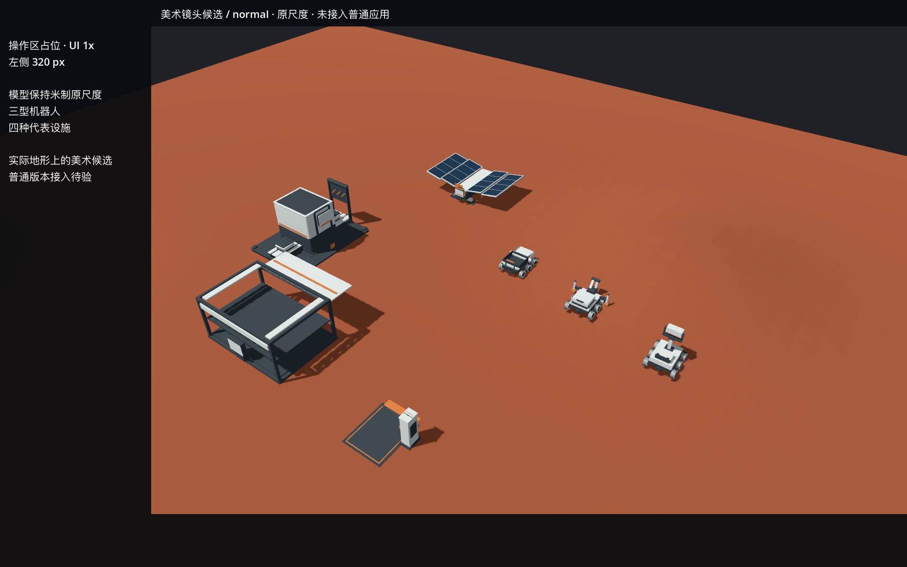
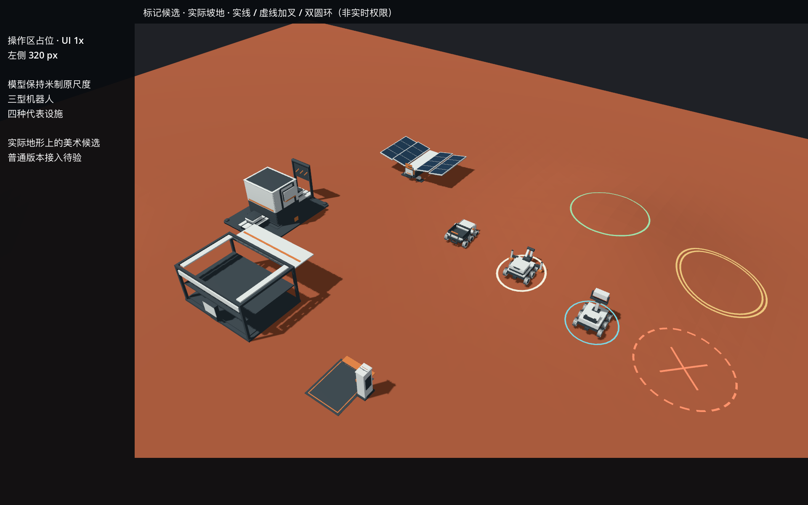

# D1.0 美术候选：实际镜头、表面与圆形标记

2026-10-07，base `259a8bf`；独立制作已交，待工程消费与所有者看样。源文件在 `art/d1/`；[接口与未到输入](INTERFACE.md)、[计划](PLAN.md)、[输入输出身份](evidence/input-output.json)可供接手。

## 看样

正常操作候选；三型机器人和四设施保持米制原尺度，左320px、上56px、下112px为UI占位。实际Main地形／光照复用，模型是独立美术校准布局：



实际坡地上的标记样式；实线、虚线加叉和双环配合颜色，样例不表示实时权限结果：



[历史预览方向对照](evidence/reference_normal.png)、[真实Main原镜头](evidence/actual-main-v0.png)、[机器人近景](evidence/close.png)、[总览](evidence/overview.png)、[低画质总览标记](evidence/markers-overview-low.png)。近景有意聚焦机器人，外围设施裁切不能据此判为缺件。

自然土／碎石作业面／压实面参数在同一原始v0几何上比较；它们是**表面样式小样，不是作业进度或已提交地形成果**：

[自然土](evidence/surface-style-0.png) / [作业面](evidence/surface-style-1.png) / [压实面](evidence/surface-style-2.png)。简单世界坐标着色，无纹理、UV依赖或高度位移；细颗粒经实图局部返修，压低高频振幅并用像素导数衰减混叠。

## 检查与边界

| 项目 | 实际证据 | 当前结论 |
|---|---|---|
| 图形环境 | Godot4.7.2 .NET、M3 Pro、Metal4.0、Forward+；实际window/viewport1920×1200 | 原生图形已跑，非性能／最低配置认证 |
| 镜头／尺度 | 正常机器人宽84.7／96.4／99.5px；总览约42–47px；模型scale1 | 正常／总览7模型均避开UI占位；点击与实际E01布局待验 |
| 标记贴地 | 五类标记138/138源检查；native高度逐顶点误差<1e-5m；三角中心离地.0208–.0276m | 此坡地未穿地或大面积悬浮；工程刷新／采样版本仍由消费端管理 |
| 低画质 | 总览实际MSAA raw0、内部渲染比例.75 | 实线、虚线叉、双环及选中/悬停均可辨；不等于最低配置性能通过 |
| 几何／状态来源 | [采集记录](evidence/capture.json)、[运行日志](evidence/capture.log)、[源检查](evidence/marker-check.log) | 真实Main baseline与art overlay分记；表面样式采样不代签正式阶段 |
| 普通应用与所有者 | 尚无本包普通应用消费／鼠标选择／阶段／保存重载／所有者接受证据 | NOT_RUN；mask消费接缝已补，实际默认场景阶段／重载对照待工程 |

主会话直接核读完整运行输出和图像；前置architect指出两套相机基线与一次提交语义，已在脚本／接口分开。收尾指出复现命令与相机完整回读不足；修复后独立复跑verify通过，这两发现已关闭。首轮受限图形启动失败后改用真实图形会话；取样时整树DISABLED移除了物理体，改为只停止回调、保留地形物理空间后干净重跑。失败日志和旧源本机保留，未作为通过证据。新工作树首次`--no-restore`缺NuGet资产文件，既有包还原后构建成功；受限包漏洞缓存有NU1900警告，未称干净构建或依赖安全通过。

## 最小复核

在本美术工作树执行；复用已安装的Godot/.NET，不新增依赖。下面保留本轮实际成功的参数；安装路径用公共变量表达，不发布私人路径。Godot位于协调目录的tools-bin，.NET位于当前用户的已有.dotnet：

```sh
YUDIAN_WORKSPACE="$(cd .. && pwd)"
YUDIAN_GODOT="$YUDIAN_WORKSPACE/tools-bin/Godot.app/Contents/MacOS/Godot"
export DOTNET_ROOT="$HOME/.dotnet"
test -x "$YUDIAN_GODOT"
python3 art/d1/verify.py
"$YUDIAN_GODOT" --headless --log-file /tmp/art-marker-check.log --path prototype --script "$PWD/art/d1/check_markers.gd"
```

实际采集需本机图形会话、base259a8bf的prototype DLL与已导入资产。输出必须使用**尚不存在的新目录**，脚本拒绝覆盖旧证据：

```sh
"$DOTNET_ROOT/dotnet" build prototype/Yudian.csproj
"$YUDIAN_GODOT" --headless --editor --import --path prototype
YUDIAN_ART_OUTPUT="/tmp/yudian-art-capture-$(date +%Y%m%dT%H%M%S)" "$YUDIAN_GODOT" --log-file /tmp/art-capture.log --path prototype --rendering-driver metal --script "$PWD/art/d1/calibrate.gd" -- --live-terrain
```

`verify.py`核当前记录的输入源与11PNG哈希、实际窗口、UI留白、尺度和原生贴地检查；改源后必须重新采图并更新身份记录，不回写旧图哈希伪造历史。工程在自己的树接入，本包不合并主线，不改canonical模型／共享材质，不重开高保真。


## 同批 mask 扩展

工程已选择按权威当前／初始高度差异派生65×65 mask，无独立美术历史账本。shader新增可选mask、开关及世界原点／跨度；mask1先显示压实面，stage1仅覆盖当前圆内未提交点，默认false保留旧单区域样式。完整参数与轴向见[接口r2](INTERFACE.md)和art/d1/palette.json。

独立 `check_mask.gd` 以合成平面／非对称节点mask作原生Metal渲染检查，14/14通过（[回执](evidence/mask-extension/mask-check.json)、[日志](evidence/mask-extension/render.log)、[输入输出身份](evidence/mask-extension/input-output.json)）；检查旧模式无需纹理、世界XZ与列/行、首末节点中心、远处历史保留、作业不覆压实、范围外不串色。**这是shader消费检查，未接入真实D1.0场景，视觉未验。** 原11图继续绑定原r1 shader/配色快照，未回写图片hash冒称扩展已实机接入。

```sh
YUDIAN_MASK_OUTPUT="/tmp/yudian-mask-check-$(date +%Y%m%dT%H%M%S)" "$YUDIAN_GODOT" --log-file /tmp/art-mask-check.log --path prototype --rendering-driver metal --script "$PWD/art/d1/check_mask.gd"
```
