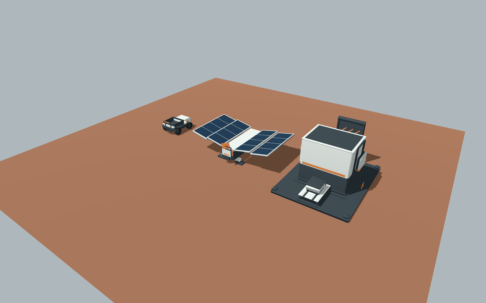

# 首批三件美术样件 · 2026-10-05

**后续优化：** 原首样记录与表中旧hash保留；新版三件火星结构已制作并独立运行，均REVIEW。当前版本/执行归属/视觉边界见[火星优化交付](art-mars-models-r2-2026-10-05.md)，不能继承旧PASS代替新检查。

**已经产出真实三维首样，不再只是需求。** M01六材质、独立预览、驮运U01、太阳能F01、加工F02均有可编辑源/资源；三件有自包含GLB、私有包装和canonical manifest，已独立导入Godot并实机出图。三张父票目前 **REVIEW**：技术可用已核验，完整视觉接受未签，所有者视觉确认 **NOT_RUN**。这些是首样候选，不能直接当作量产比例、最终配色或游戏接入。

上图是 **Godot独立实机预览的展示中景**，相机(9,9,13)、FOV50；不是固定正常镜头验收图。正常指挥镜头的[同场尺度图](production-r1-receipts/final-20261005/images/gallery/normal.png)另存；U01=(-5,0,0)、F01=(0,0,0)、F02=(5,0,0)，相同米制尺度。概念图/离线渲染本轮未使用，不把展示图称为游戏运行。

## 实际交付

| 样件 | 原创源与生成器 | 真实GLB / manifest | 当前实测 |
|---|---|---|---|
| U01 驮运 | [源目录报告](../../../../art/source/units/tuoyun-r1/state-report.md) | [GLB](../../../../prototype/assets/units/tuoyun-r1/tuoyun-r1.glb)、[manifest](../../../../art/manifests/tuoyun-r1.json) | 12网格/69材质面/2040三角面；4接点；空载1.188×1.6×.85m，有载顶.86m |
| F01 太阳能 | [源目录报告](../../../../art/source/facilities/solar-r1/state-report.md) | [GLB](../../../../prototype/assets/facilities/solar-r1/solar-r1.glb)、[manifest](../../../../art/manifests/solar-r1.json) | 69网格/69材质面/828三角面；2接点；完成态约4.771×3.06×1.207m |
| F02 加工 | [源目录报告](../../../../art/source/facilities/processor-r1/state-report.md) | [GLB](../../../../prototype/assets/facilities/processor-r1/processor-r1.glb)、[manifest](../../../../art/manifests/processor-r1.json) | 14网格/27材质面/1140三角面；4接点；静态3.6×4.8×2.4m |

每个源目录保留Python标准库生成器、glTF+bin、同字节GLB和生成事实。无第三方模型、下载贴图或新增依赖。模型源中的角色材质承载分区，实机逐surface绑定已接受的M01资源；六种角色/试样参数仍是视觉候选。未做性能预算、LOD成品或最终纹理，不能从低面数推导性能通过。

U01保留开放货台、独立箱、车身分区和四接点；局部将锁扣抬高并增加双臂/带孔支承，充电盖扩大/暖色，轮面添加随轮旋转的暖色标记。外形实测仍在首样候选1.2×1.6×.9m内；货台Y.48/箱体.64×.70×.38与设施进出料参照不变。活动包络后方扩至Z.90，以容纳工作部位；不是新的通行/碰撞规则。

F01直立双折的packed/installed高1.9m沿已冻结局部修订；束带避开翼片、packed收脚，四建设phase与七运行state分开。实际部署中点高2.85m属于活动包络。F02固定两箱，三源clips；offline只展示disabled，不增加第八态或库存规则。

## 已验证与视觉边界

| 核验 | U01 | F01 | F02 |
|---|---|---|---|
| 全新空工程仅GLB导入、实际网格/接点/clip核对 | PASS | PASS | PASS |
| 状态/phase/cargo、重复应用、活动包络、根固定 | 98姿态PASS | 392姿态PASS | 49姿态PASS |
| 非法输入保持上次合法对象 | 10项PASS | 10项PASS | 10项PASS |
| 倒拨绝对时间 / 三种故障原因 / 缺clip保持 | 4/9/1 PASS | 4/9/1 PASS | 4/9/1 PASS |
| 两帧实际渲染后工作姿态保持 | PASS | PASS | PASS |
| 实机截图/正常与近景/方向/指定时刻 | 29张 | 22张 | 17张 |
| 主控视觉结论 | 运输轮廓/空有载已看；小工作部位完整盲比待复核 | 阶段/展开轮廓已看；完整运行态视觉待复核 | 进出结构/停机挡板/维修开盖已看；完整工作可读性待复核 |
| 所有者最终效果 | NOT_RUN | NOT_RUN | NOT_RUN |

图像索引含原始PNG、原采集JSON哈希、GLB实际哈希、实际包装版本哈希、请求/读回view、preset与根变换；见[当前证据](production-r1-receipts/final-20261005/README.md)。固定正常/近景、白昼光照、M01、1920×1200、Metal Forward+均沿已接受预览合同。同场另有2张，不计入单件68张。主控未组织真人随机盲比，不制造识别率；画面已出/姿态有差异不等于全面可读性通过。U01小锁扣/口盖、F01指示片在正常距离占像素较少，完整盲比是下一道门槛，不能拿近景替代。

实际Godot为4.7.2.stable.mono.official.ed1daf0bf，Metal4 Forward+，Apple M3 Pro (Apple9)。Headless用于结构/接口；真实窗口用于图像。所有当前运行均exit0且无ERROR，保留此前失败而不把exit0单独当通过。F02工作极值经实际重采样修正：.5秒压头Y1.55/挡板25°、1.5秒Y1.725/12.5°，两帧不同。F01导入器给其他节点加默认轨，主控局部seek保留已经应用的其他源姿态，防止运行状态把展开/收脚复位。两设施原包装缓存后漏检缺clip，针对性补成每次应用先检查，回归通过。

U01带孔支承的孔内切半径减方轴旋转包络余量约.005541m；轴对支撑顶面余量.008686m。横杆/支臂26角度及原盖板106角度是离散几何检查；不把它称为全模型连续SAT扫掠。所有正式碰撞、停靠、通行、库存、电力、维修、矿物、保存与游戏适配 **NOT_RUN/未实施**。

## 真实GLM结果与主控归属

使用全局`agent-bridge`技能约定的Agent Bridge `zcode`，同会话原生`/model GLM-5.3-Flash`确认；不是OpenAI子代理。技能文件在用户全局目录，仓库不复制该文件。下表时长取Bridge实际elapsed_sec，未采用工人估算；Bridge使用量是会话统计/缓存信息，不可相加当成本，实际费用未知。

| 真实任务 | 结果/提交 | 实际秒数 | 主控处理 |
|---|---|---:|---|
| task_1022c35cd9 U01 STATE-B | cancelled；无commit，仅2个未跟踪包装文件 | 1396 | 保留文件，完成manifest/守卫/实机验证；不能写GLM SUBMITTED |
| task_4fb2c9fb5d F01 GEO-WRITE | cancelled；无文件/commit | 795 | 停止重复推演，主控制作源/GLB/包装；原task_e2225ffe24也已取消 |
| task_ea59265629 F02 GEO | completed / 3e98c33 | 1089 | 独立导入/几何/接点核验后集成 |
| task_bbb7ef9f84 F02 STATE-A | completed / 7f818c2 | 208 | 实际导入发现30fps单键极值损失，缩票修正 |
| task_426dec2dbf F02极值平台返修 | completed / 76121b5 | 86 | 独立确认实际极值/循环后接受源；主控包装 |

[Bridge结果记录](production-r1-receipts/final-20261005/bridge/task_1022c35cd9.json)及同目录五份结果保留完成/取消状态与提交；原文本私人路径以`<workspace>/<temp>`替换，任务/结果/时间/用量不改。三会话均已结束。U01源2b2abd6与后续主控r6成果保留；M01/PREVIEW已接受的GLM成果不重做。只读architect/explorer/reviewer负责审查，未充作GLM制作者。

## 接下来与未冻结项

本批已有可供真实比较的首样。先按[视觉矩阵](../requirements/visual-acceptance-r1.md)完成正常距离的动态/盲比和所有者效果确认；局部混淆就REWORK该差异，源、结构和已通过接口保留。若需要扩大动作/改变材质对比，由主控先冻结输入，GLM再承担确定性实现；没有冻结的返修票不假写READY。

长远配色/比例、微小工作部位的最终视觉方案和正式游戏状态适配仍未冻结，分别影响量产一致性、正常镜头识别与游戏接入。主线c76b0ea中Godot候选、静态碰撞与T3d单区域内存提交已限定接受；正式阶段/增量/渲染物理导航保存同步未冻结。因此T01/T02正式地形继续BLOCKED，P2继续DRAFT；本批没有生产土坡/矿点、没有改Main/工程合同/根PLAN/TODO。

生产位于独立`art/production-r1-20261004`分支；需求成果保留。2026-10-05主线只读核到c76b0ea且干净；不把旧3999d30快照当当前main，不合并/推送本批。
