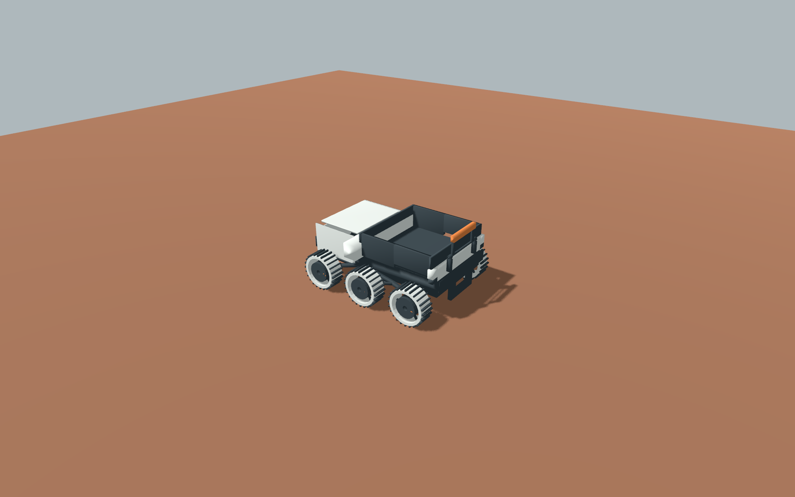

# 火星结构优化首样 · 2026-10-05

**后续局部修正：** F01已升manifest revision3并解决指定近景内罩遮挡，见[维护可见性记录](art-solar-maintenance-r3-2026-10-05.md)。下文revision2/遮挡描述保留为r2历史事实，不覆盖当前F01；U01/F02未变。

三件已更新为真实可编辑源与GLB；父票均 **REVIEW**。主控完成本轮制作与独立核验，所有者尚未接受新版。沿用亮色模块化方向、共享六材质、连接点与已有状态；不进入P2或游戏规则。

| 模型 / manifest revision | 本轮局部改变 | 实际导入（三角面 / mesh / surface） |
|---|---|---|
| U01 / 3 | 六金属抓地轮、Rocker/Bogie分级悬挂、轮轴与非接触防尘圈、维修盖下独立受保护模块；开放货台保留 | 7312 / 19 / 109 |
| F01 / 2 | 后检修箱内模块/内罩/实接安装座、固定段接线护槽；双折翼与四阶段/七态保留 | 888 / 74 / 74 |
| F02 / 2 | 短进料口遮护、检修内罩、实接侧壁的导热安装座与外露散热板 | 1224 / 17 / 33 |

源目录名继续使用r1，当前版本由manifest revision与哈希识别。旧GLB/图像可从6135141及原首样证据恢复；旧报告仅说明当时版本，不覆盖本轮。所有三件无纹理；材质色值仍是候选。U01面数由2040增至7312，整场性能预算未测，不能按面数直接判定性能通过。

## 已验证

- 三生成器实际运行，源glTF/bin/GLB复现字节一致；运行GLB与源GLB相同，逐surface角色/导入节点、manifest源哈希匹配。全hash与文件索引见[capture-index](mars-r2-receipts/capture-index.json)。
- Godot 4.7.2 .NET实际导入；U01 98、F01 392、F02 49，共539规定姿态；30非法输入保持、12倒拨时间、27故障原因姿态及三件缺clip保持，失败均0。[实际报告](mars-r2-receipts/runs/tuoyun-actual.json)及同目录solar/processor报告记录边界。
- 六轮在t=.25/.75/.875/1.25共24次实际Basis核对，通过；循环末段、pivot/scale、四悬挂节点及三条单key复位轨均检查。导入器删重复尾key，因此使用实际姿态证明，不把源key数量硬套给导入clip。
- U01六轮层级、轮轴进入真实轮毂孔、最大滚动半径.205m；内罩与维修盖106个整数角度的最小SAT间隔.022732m。静态1.26×1.6×.85m，有载高.86m，货台Y.48及货箱.64×.70×.38保留。宽1.30m是上限候选，不是正式生产比例。
- 设施新增件八组、每组101规定姿态，最小间隔均≥.0075m；[数据与方法](mars-r2-receipts/runs/facility-clearance.json)、[可运行源检查](mars-r2-receipts/checks/check_facility_clearance.py)。这是有限采样与分离轴证据，不是连续全机构或工程公差认证。
- 33张1920×1200 PNG为真实Metal/forward_plus独立美术预览；采集暂停到规定时刻并等两帧。normal/close、方向、载荷、状态及太阳能phase分开记录；复用原相机/光照/六材质，不改公共预览。没有使用概念图或离线渲染替代。

首次沙箱缓存/IPC错误不算通过；工具授权后实际导入成功。临时manifest实例根和新增轮轨检查器假设有误，修复/缩步后检查通过；三份失败log保留于runs，未靠改模型或删除运动检查放行。

## 主控看样与可比较边界

[固定正常镜头同场图](mars-r2-receipts/images/gallery/normal.png)下，货台运输车、太阳能宽翼、加工主腔/料区仍可辨；小防护件与细动作不能据此宣称全部可读。以下近景用于结构核查，不代替正常镜头验收。

- U01近景可见三个近侧金属抓地轮及悬挂连接；[维护180°](mars-r2-receipts/images/tuoyun-detail-maintenance-close-180/blind_0001.png)确认外盖开启后有独立内模块，开放货台未被封闭。
- F02[维护180°](mars-r2-receipts/images/processor-detail-maintenance-close-180/blind_0001.png)可见内罩与料口遮护，工作区保持开放。offline继续仅映射disabled；未定义新的输出传送结构/工艺。
- F01[维护0°](mars-r2-receipts/images/solar-detail-maintenance-close-0/blind_0001.png)及90°仍被外盖遮住内罩。**源结构及规定姿态净空已核，内罩视觉确认未完成**；不能把三个资产一并写成防护细节已看清。正式维护画面验收需补能看见内模块的检视角度，或局部调整外盖角度后重验受影响姿态。

三件展示图另见[展示中景](mars-r2-receipts/images/gallery/presentation.png)：它有独立相机，仅用于呈现效果。图形证据是独立资产预览，不是Main里的游戏运行截图；完整盲比与七态细动作的正常距离辨认仍NOT_RUN。

## 候选与NOT_RUN

六轮是本项目运输岗位的候选，并非所有火星车必须六轮。摇臂层级/pivot存在，**未实现地形响应**；防尘圈是非接触挡尘结构，未证明密封。安装座/散热板表达传导到外露表面的路径，未验证热性能。太阳能积尘清扫方式、工程载荷/越障/温控/可靠性、游戏整场性能与接入、所有者新版视觉接受均NOT_RUN。候选比例/配色不转成最终规范，不修改库存、电力、维修、通行、矿物或保存规则。

## 实际执行归属与独立复核

本轮通过Agent Bridge给两名ZCode GLM-5.3-Flash派了真实冻结源票；U01 task_b9650de6ee运行807秒、设施task_e26822198e运行591秒，均只读/推演无交件，取消并结束session。GLM无本轮资产提交，用量不可见；主控完成全部新版源、manifest和取证，详见[Bridge记录](mars-r2-receipts/bridge.json)。不把原生OpenAI只读审查冒称GLM产出。

只读几何审查独立确认U01六轮层级/轴毂/净空；architect最终检查哈希、实际报告及指定图像，指出F01遮挡和旧入口同步，两项已明确写入交付。审查者未运行Godot，不冒领主控运行结果。[独立复核](mars-r2-receipts/review.md)。

归档PNG、输入manifest/包装/材质/预览源原字节保存；JSON/log的机器绝对路径被替换为占位符，索引分别记录raw_sha256和archive_sha256，不宣称脱敏JSON与原件字节一致。检查脚本和输入快照用于复现本次独立项目，不作为新公共生产流水线。

最终文档/归档检查：`python3 tools/verify_documents.py`、`python3 docs/art/production/evidence/mars-r2-receipts/checks/verify_archive.py`、`git diff --check`实际PASS。architect第二次复核只指出U01历史行状态措辞，已修正；源/GLB未再变化。

收口只读核 main 为干净eb5ba1f，技术线仍保留完整T3/同步与稳定性能预算；本轮未写主线或根PLAN/TODO，也未将其后续改动并入美术源。
