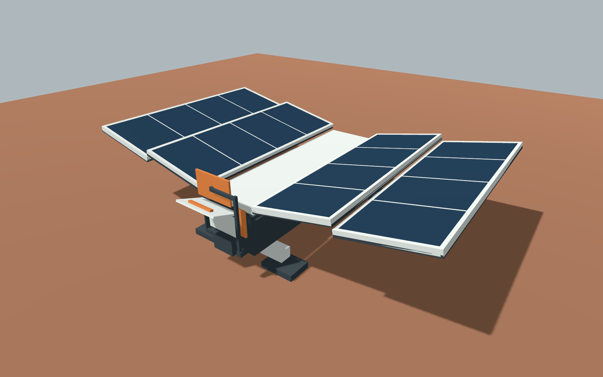

# 太阳能维护可见性局部优化 · 2026-10-05

**F01新版内罩已在固定近景0°/90°确认可见；父票继续REVIEW。** 所有者认可上一轮总体效果并授权继续；本次主控只改检修盖源动画终点，由X -60°改为-110°，让外盖抬到舱口上方。保持上沿pivot、原造型/材质、四建设阶段与七运行状态，模型面数不变；其他两件未改动。没有新的GLM派单。

与[上轮同相机维护图](mars-r2-receipts/images/solar-detail-maintenance-close-0/blind_0001.png)比较：外盖下露出白色内层保护罩，电子模块继续封闭；没有加清扫装置或空气冷却设施。正常镜头/近景仍使用已冻结的相机、光、M01和1920×1200尺寸，不靠单件改曝光/放大取胜。

## 真实版本与检查

- F01 canonical manifest **revision 3**；GLB SHA256 `3e8b475006e71ac599f0f2d160c97e48229dbef756f6d9f80e4dce10eb4a0a73`。源/运行GLB相同，74 mesh / 74 surface / 888三角面、2socket、0纹理。当前源生成器、glTF/bin、材质/预览/manifest哈希见[新索引](solar-maintenance-r3-receipts/capture-index.json)，上轮revision2和旧证据保留。
- 盖板与把手分别检查0..110°的111个整数角，对72个邻件共144对；服务框/内罩、指示片/支架、停机片、折翼均包含。AABB有正分离先用它证明，倾斜盖板对IndicatorBlade包围盒重叠时复用既有完整凸体SAT，实际最小分离.00683799m，超过本次候选5mm。折翼绕Z转动/脚沿X收拢不进入盖板的Z区间，阶段保留。
- 活动盖板+把手源采样最大Z **1.84021695m**，manifest保守上限由1.81改为**1.85m**；这是合法源动作变化后的实测候选包络更新，不是放宽未知错误。源重生成glTF/bin/GLB字节一致；[净空结果](solar-maintenance-r3-receipts/runs/cover-clearance.json)与[可运行源检查](solar-maintenance-r3-receipts/checks/check_cover.py)。
- Godot 4.7.2 .NET实际新导入，392阶段/状态姿态、10非法输入保持、4倒拨时间、9故障原因姿态、缺clip保持均通过；另核四phase×t=0/.5/1/2共**16个维护盖真实Basis/pivot**。实际最大Z1.83855176m在新包络内。[真实矩阵](solar-maintenance-r3-receipts/runs/solar-actual.json)；不是沿用revision2的PASS。
- 10张真实Metal/forward_plus独立资产PNG：idle/maintenance成对，normal三方向共6、close两方向共4。两帧稳定后按指定时间暂停采集；不是离线渲染、概念图或游戏Main截图。脱敏JSON/log分别记raw和archive哈希，PNG不改字节。

检查器首版把AABB重叠当碰撞，第二版误读旧SAT自检返回tuple，已停步读真实接口与solar非索引三角面格式，经architect复核后使用真实SAT。模型和5mm门槛未为假阳性改动；诊断来自工具返回，PLAN保留重排说明，不将失败记PASS。

## 本轮可读性结论与限制

[0°正常维护图](solar-maintenance-r3-receipts/images/solar-maintenance-normal-0/blind_0001.png)与idle、[90°正常维护图](solar-maintenance-r3-receipts/images/solar-maintenance-normal-90/blind_0001.png)与idle，主控可见检修侧白盖抬起后的侧轮廓差异；[180°](solar-maintenance-r3-receipts/images/solar-maintenance-normal-180/blind_0001.png)背向舱口，细节较弱。**近景确认内罩可见，不代表正常距离每方向均能可靠辨认维护状态**；完整七态盲比/所有者新版接受仍NOT_RUN。

另复看未改动U01/F02上轮normal 0°的idle/maintenance原图：开盖有轮廓差异；没有重跑它们的模型检查，也不新增全态通过结论。参考证据仍是上轮各自实际hash。

这解决了上一轮F01内罩完全被外盖挡住的已知近景缺口。工程密封/防尘/散热/载荷可靠性、游戏集成与整场性能未测；相机、候选配色/比例不转成最终生产规范。维护操作空间的工程认证与完整视觉接受继续保留NOT_RUN。

独立architect已核源变化、包络/实际报告与指定图像，未发现新增阻塞；强调有限采样与180°识别限制，已保留。见[审查记录](solar-maintenance-r3-receipts/review.md)。

最终验证：`python3 tools/verify_documents.py`、`python3 docs/art/production/evidence/solar-maintenance-r3-receipts/checks/verify_archive.py`、`git diff --check`实际PASS。本轮只写F01私有源/GLB/manifest与美术文档，公共材质/预览/Main及技术规则未改。
