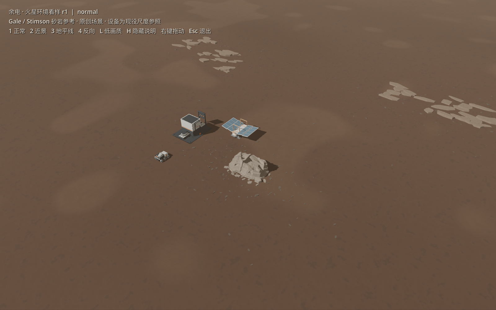
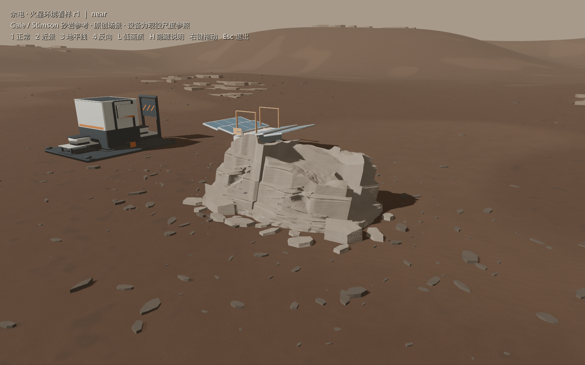

# 真实火星调研、素材需求与场景框架 r1

2026-10-07｜所有者要求的本轮交付：先调研真实火星照片、地质与探测器，再优化全素材需求、建立同条件场景框架，挑一件由Astra xhigh用Blender试作。基础分支main `718905d`，独立art/mars-research-r1-20261007；不将旧PR43视觉返工稿当成质量锚点。

## 制作依据

完整需求在 [MARS-BRIEF](MARS-BRIEF.md)：自然地面/作业面/开挖截面/露头/碎屑/远景、三机器人、六设施、货箱/回收件、六资源、标记与共享材质都有制作目标、看样条件和工程边界。默认Blender；已接受技术接口保留。

[地质依据](GEOLOGY.md)区分元素检测、矿物与可采矿床。“铁矿”暂按含铁原料候选解释；铜在Gale有局部元素增强，未证明游戏采点/稳定矿床；工业产品继续按游戏设定表达。现有名称/ID/配方/库存未更改，视觉辨识可用形体、封装与类别标识，不捏造裸铜/铜绿矿脉。

[视觉依据](VISUAL-SOURCES.md)逐图记录地点、日期、仪器、色彩处理和尺度限制。[4张实际看过的制作参考](references/sources.json)只作reference，不进runtime贴图。主参考为Gale/Stimson风积砂岩，Murray泥岩只作邻接对照，Jezero不拼成已知Gale地质剖面；所有网格和PBR纹理原创，色板与布局是设计推论。

## 场景与单件

[场景目录/入口](../../../../art/environment/mars-lookdev-r1/README.md)：连续起伏地表、片状碎屑/少量露岩、低远脊/地平线、一个英雄露头，现役驮运/太阳能/加工设施只作米制尺度参照。独立Godot4.7.2项目，1正常/2近景/3地平线/4反向，L低画质、H说明、右键拖动、Esc退出。它不是Main或已更新的试玩包。

[单件冻结需求](ASTRA-OUTCROP.md)实际派给 `mars_outcrop_astra`（实现工人，gpt-6-astra/xhigh，fork none）；资产在 [Blender源目录](../../../../art/source/environment/mars-outcrop-r1/README.md)。只做原创层状砂岩露头，无矿种/障碍/采矿语义。UV错误、首版柱墙与次版圆滑层边均真实否决/保留，未以技术PASS代替视觉质量。

## 核验与剩余

- 地形支撑源主控独立重开：米制、有限顶点、四锚点邻近顶点高度、3材质/mesh、再导出GLB字节相同均通过，记录 [root-ground-check.json](evidence/root-ground-check.json)。
- 场景已实际Forward+/Metal渲染；四固定视角、低画质/说明切换、拖动复位的真实输入事件自检已通过。捕获文件与源hash确保实际消费同版资产；主控移走旧缓存及抽取PNG后无缓存导入通过；[最终5帧](evidence/native/)与[capture](evidence/native/capture.json)记录同版源/自动LOD0。三张抽取PNG逐字节等于GLB内嵌图，见[贴图核对](evidence/embedded-textures.json)。
- 首件现阶段 **REVIEW / 首件看样候选**：局部薄片悬边与破口已返工，[architect复核](evidence/architect-review.md)确认原否决已解除到候选阶段。主控独立[源/PBR/再导出与GLB导入](evidence/root-outcrop-check.json)通过：20封闭块、3×2048打包纹理；仅1个切线xyz舍入差约0.0001，其他buffer和JSON严格一致，**未声称整GLB字节相同**。
- 所有者最终视觉、Main接入/游戏整平保存/采矿/碰撞导航、整场性能、其他资产的高保真重制均 **NOT_RUN**。本批没有改变这些事实。

执行与失败改计划见 [PLAN](PLAN.md)；必要失败图/元数据在 [evidence](evidence/)。局部质量问题修对应素材，研究/全需求矩阵/场景框架与已有技术成果保留。

## 本轮看样

源文件可直接在Blender编辑；场景双击 [open-lookdev.command](../../../../art/environment/mars-lookdev-r1/open-lookdev.command) 打开。制作与验收均在独立看样进行，现役设备未在此批重制。

精确英雄GLB：`141380133cb362aae0dcf52deb3ac1e62f33c31851d7437f92240b44da05cacf`；Blender米制宽/深/高约6.149×4.142×2.332m，47,998tri，14cm埋入余量。支撑地形149,362tri/763碎屑/108岩板；这些是本次统计，不是最低配置预算。

[草稿 PR44](https://github.com/liuyejinghong/yudian-game/pull/44) 已提交供审阅；不可变源与证据提交：`d24736bc8b818105c67bb28e31ca49f1ebbbc5dd`。候选尚未合并到现役游戏。
