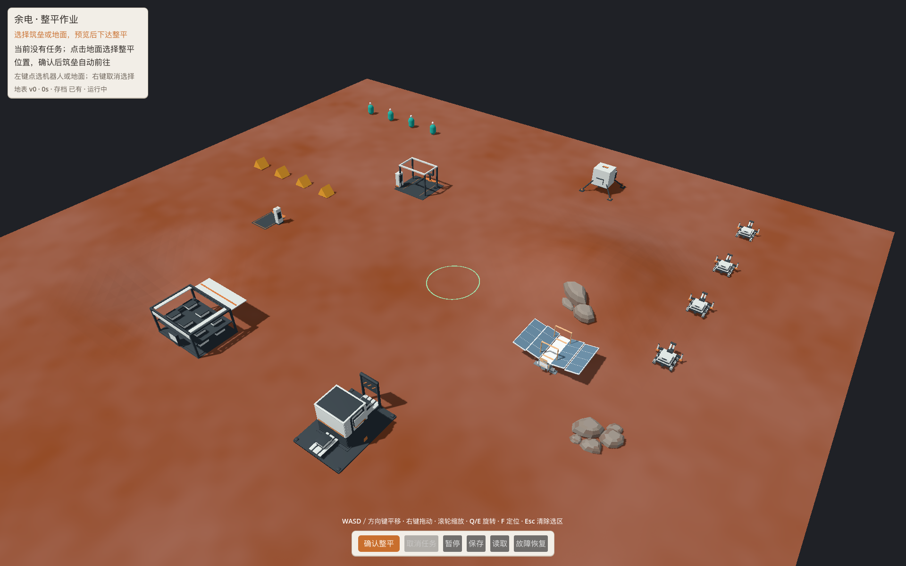
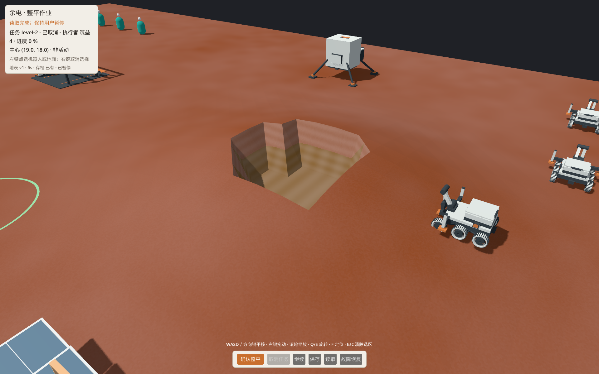

# 地表低保真视觉补齐 r1 · 2026-10-07

**当前视觉状态：REWORK。** 所有者看本轮截图后反馈“有点差”，追问需求来源与完整性；本轮视觉未通过。原技术检查与可编辑源保留，不以技术通过抵消视觉返工。正式游戏中的最终验收仍未运行。

本批改善均匀棕色地面，保留浅色设备与操作标记的优先级：自然土增加克制的米级色差与细颗粒，作业面改为稀疏碎石点，压实面保持平整，真实坡面及整平切边增加沿世界高度的层次。交两种可复用原创岩块组。都是低保真候选，未制作高保真贴图或正式矿层资产。



| 范围 | 制作 | 独立技术与读图 | 默认Main/试玩包消费 | 所有者最终视觉 |
|---|---|---|---|---|
| ART-ENV-SURFACE-01 本次质感/坡面子片 | REWORK | 14/14原mask回归、6/6斜面/边界检查、三状态同镜头实际Main对照 | NOT_RUN；runtime副本已齐，待主控合入/打包 | 本轮截图REWORK；正式游戏最终未验 |
| ART-ENV-PROP-01 本次两组岩块子片 | REWORK | 两Blender源重开/再导出一致、Godot原生GLB解析及正常/近景坡地示例 | NOT_RUN；未注册默认世界或保存/重建生命周期 | 本轮截图REWORK；正式游戏最终未验 |

父票完整范围、T01/T02正式阶段、资源矿点、全场性能和高保真未因此完成。主控持有的美术TODO未修改；本回执供主控补本批子片证据。

## 前后看样

自然土：[正常改前](evidence/natural/normal-before.png) / [正常改后](evidence/natural/normal-after.png) / [低画质改后](evidence/natural/low-after.png)。岩块：[近景](evidence/natural/rocks-close.png)。

暂停施工：[改前](evidence/working/close-before.png) / [改后](evidence/working/close-after.png)。HUD显示真实加载的level-1、14%进度与暂停；只读存档来自工程已有检查，不用本批图片重新签署施工或保存行为。

已有整平成果：[改前](evidence/committed/close-before.png) / [改后](evidence/committed/close-after.png) / [低画质改后](evidence/committed/low-after.png)。载入世界v1、level-2在0%取消，显示的是早先整平成果与旧压实面；不是本次任务部分施工后取消。方折切边来自原权威粗网格，本批只让坡面层次更可辨，未圆滑或移动实际几何。



## 消费与边界

- shader主源：[surface.gdshader](../../../../art/d1/surface.gdshader)；runtime：[精确副本](../../../../prototype/assets/d1-art/surface.gdshader)。原stage/圆区域/mask/origin/span输入不变，已压实优先，未变高节点不冒充完整施工区域。世界法线确定坡度，世界高度确定表面层次；不写VERTEX/NORMAL、不增加高度/任务/存档账本。
- 岩块：[源与manifest](../../../../art/environment/terrain-look-r1/rocks/manifest.json)。低岩簇3×2.5m、高.88m，430tri/5块；层状露头4×2m、高1.45m，258tri/3块。原创确定性Blender多面体，可编辑.blend与GLB齐，无动画/碰撞/矿产或阻挡含义。
- 示例位置低岩簇(19,4)、露头(13,-5)仅为美术进程添加；逐GLB底部顶点采样实际Main表面并下沉2cm，最大底部间隙为-2cm。露头坡地下沉深度最高约71cm，作为有限坡地嵌入示例；更陡坡/任意布点未认证，不能照此自动散布全地图。两个位置避开现有设施/机器人，但未验玩家命令和导航。
- 本批未改Main/C#/相机/PlayerUI/共享M01/canonical单位设施/根文档。新shader副本合入后由已有Main.PlayerVisuals消费；岩块正式布置需要工程确定允许区域与重载重建，关闭装饰不应影响真实障碍或资源。

## 证据与复跑

实际Main既有DLL：SHA256 `2f0e91e6d918a4b0b5eee53dcca5d15ff8986b1897869fb1e50c5745521bee43`、MVID `982ab56b-3823-4aa2-91e9-359475fb085f`，Godot4.7.2、Metal4/Forward+、M3 Pro、CLR10.0.12。明确应用已批准normal pos(25.12,28.8,26.3)/focus(4,0,-2.5)/FOV50；不是重新构建的718905d正式包。原状/工作/历史整平共20张1920×1200PNG，low关闭MSAA、内部缩放.75；每一对只换shader，几何和mask前后hash相同。采集脚本暂停Main/控制器/实体更新，保留地形物理，只调用既有load消费临时测试槽；未下单、保存或改写原工程存档。

[全部输入输出身份](evidence/identity.json)、[Blender独立检查](evidence/blender-check.log)、[mask回归](evidence/mask/mask-check.json)、[斜面与边界](evidence/slope/surface-check.json)。斜面检查只在合成场景增加unshaded以隔离光照，确认同一点坡面色与水平面不同、两镜头世界坡度不变、边界两侧与低画质仍有区分；它不替代真实Main画面。

在本分支根目录：

```sh
python3 art/environment/terrain-look-r1/verify.py
"$YUDIAN_BLENDER" --background --factory-startup --python-exit-code 1 --python art/environment/terrain-look-r1/rocks/generate_rocks.py -- --check
YUDIAN_MASK_OUTPUT="$YUDIAN_NEW_MASK_DIR" "$YUDIAN_GODOT" --log-file /tmp/terrain-mask.log --path "$YUDIAN_ENGINEERING_TREE/prototype" --rendering-driver metal --script "$PWD/art/d1/check_mask.gd"
YUDIAN_TERRAIN_SURFACE_CHECK="$YUDIAN_NEW_SURFACE_DIR" "$YUDIAN_GODOT" --log-file /tmp/terrain-surface.log --path "$YUDIAN_ENGINEERING_TREE/prototype" --rendering-driver metal --script "$PWD/art/environment/terrain-look-r1/check_surface.gd"
YUDIAN_TERRAIN_LOOK_OUTPUT="$YUDIAN_NEW_CAPTURE_DIR" YUDIAN_TERRAIN_LOOK_ROCKS=1 "$YUDIAN_GODOT" --log-file /tmp/terrain-look.log --path "$YUDIAN_ENGINEERING_TREE/prototype" --rendering-driver metal --script "$PWD/art/environment/terrain-look-r1/capture.gd"
```

各输出目录必须新建。工程路径须已有可运行的D1 Main/DLL与canonical资源，不由美术脚本构建。工作/历史态追加`YUDIAN_TERRAIN_LOOK_LOAD=1 YUDIAN_PLAYER_GUI_TEST=1 YUDIAN_PLAYER_TEST_SAVE="$PWD/docs/art/production/terrain-look-r1/evidence/inputs/engineering-working-v0.json"`（历史态改engineering-cancelled-v1.json），使用临时输入槽，不启用PLAYER_SELF_TEST或默认用户槽。

首次Blender沙箱原生初始化崩溃、尝试无效OpenGL后重排为获批准后台进程，实际生成/复核通过；新增GDScript核验首轮推断类型失败，显式String后通过。首轮过强斑驳、方格碎石、裁切镜头和岩块近机器人位置均已局部修正重采；旧临时文件保留，不覆盖最终证据。

独立architect收尾：重新运行身份核验、文档及格式检查并读实际对照图，未发现实质缺陷；未代签正式集成、性能或所有者视觉。

## 本轮需求来源与缺口

- [美术方向v0.2](../../art-direction.md)：Surviving Mars: Relaunched / Anno 2205参考，明亮专业的工程荒地，建设前后可读，材质与气氛更丰富；不是逐项生产规范。
- [DT-A03](../../../roadmap/art-work-packages.md)：自然土/作业面/压实面，真实改造成果与表面同时可读，纹理比例/接缝/重复检查；贴图不是必须形式，但这不等于简单着色已达到质量要求。
- [DT-A08](../../../roadmap/art-work-packages.md)：少量岩块/露头/可辨自然轮廓，避免遮挡与误报资源，坡地接合；没有冻结本轮岩块形体或成品质感。
- [早期工单T01/T02](../2026-10-04-t2-asset-work-order.md)：原坡/施工中/整平后及矿点开挖阶段，边界同源、截面矿层可辨；本轮未交这些完整阶段包。
- [首样视觉方法](../requirements/visual-acceptance-r1.md)主要覆盖M01、机器人和设施，没有专门的地形视觉质量样板与失败标准。

本轮“只修改shader、两组低面数岩块、程序斑驳/水平色层”是主会话选择的实施切片，用户批准的是推进地表改善建议，未批准这些具体外观为目标质量。当前仍缺正常/近景目标样板、土壤/砾石/岩层的形体与材质关系、自然和人工边界过渡、岩块变体及布置尺度，以及视觉通过/返工对照。完整可执行的地形美术需求尚未冻结；应在继续制作前补齐目标质量与样板，再依正常游戏视距验收。
