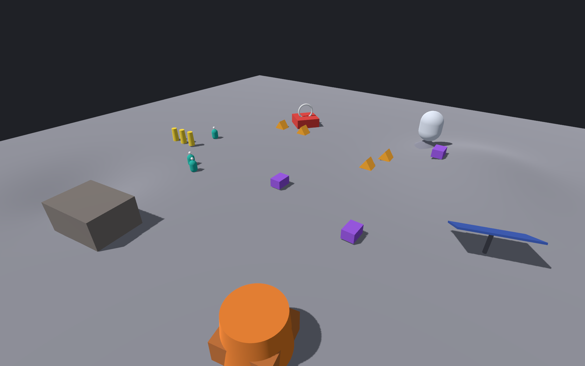
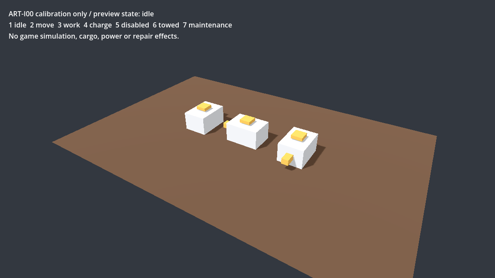

# 2026-10-04 接管复验

结论：保留既有灰模并完成 QA-01–QA-06 的受限整改、真实 GLM 外包闭环与 ART-I00 技术校准。原生 Metal、有效进程峰值内存和干净检出导出已有本轮证据；三轮帧率变动明显，不能签性能稳定或未来联合负载余量充足。仍是渲染探针，不是可玩的目标委托游戏。

## 基线与身份

接手时 main=`902a662392e8047364ace7c0ce93d151945dbb59`，tracked 工作树干净；PR [#13](https://github.com/liuyejinghong/yudian-game/pull/13) 与 [#14](https://github.com/liuyejinghong/yudian-game/pull/14) 均 OPEN、未合并。读取各自真实提交 `f32ac659` / `171c6107`，没有因为 main 缺文件而跳过。Issue #4 CLOSED、#5 OPEN、#12 CLOSED；它们的历史报告原样保留。本轮不自动合并或关闭 Issue，不操作旧 MUD。

主控工作树、GLM 工作树和干净构建检出隔离。旧 ZCode 会话未终止；所有者确认已停止执行。运行代码固定在 `7341ea83a3ad879ba98a496792d43eb9cd2d70ab`，clean checkout 的 build 身份 `working_tree_dirty=false`。为公开前脱敏，发布分支 `qa/t1-t2-reviewed-20261004` 将内部提交整理为 `9128523c2a209fd50d14dc6043e0b219dc3861cf`，只在测试注释移除私人路径；原开发历史留本机未推送。已逐项核对公开版本全部运行源码/fixture/资产及构建脚本hash与已测包一致。三轮包仍标内部源提交7341ea8，不能改写为公开SHA或文档HEAD；每次summary与配套清单记录真实来源。

参考机实核：Mac15,6 / Apple M3 Pro / 12 核 CPU / 36GB，macOS 27.0 arm64。Godot `4.7.2.stable.mono.official.ed1daf0bf`；SDK `10.0.401`；项目 TFM **net8.0**；runtimeconfig 与实际导出进程均为 **.NET 8.0.31 / Arm64**。安装 SDK10 没有迁移游戏运行目标。[machine.json](../evidence/2026-10-04-takeover/machine.json) 不含机器序列号。

## 对七项审查发现的复核

| 发现 | 本轮证据与处理 | 结论边界 |
|---|---|---|
| R01 证据/内存/乐观外推 | 旧 CSV/summary 原件副本和 hash；新三轮 Metal CSV、日志、summary、time 原文、复算、截图 | 测量交付闭合；稳定性和完整游戏性能未通过 |
| R02 输出/中断 | 旧 .app 的 Resources/benchmarks 已有结果，签名核验失败；新默认 user://唯一 run-id；只读移动包、不同 cwd 两次成功，提前退出130，签名仍有效 | 不写包、不覆盖；硬杀可能仅有部分 CSV，不声称恢复游戏存档 |
| R03 输入合同 | 旧包 robots_total=100 仍生成12；NaN与3设施各4秒超时且后者连续抛错；新合同与派生量校验，19个实际错误用例exit1且不建场景 | 合法S档保留；边界是探针限制，不是产品规模承诺 |
| R04 实际身份 | requested/applied/observed 分层；实际 Forward+/Metal、Mobile/Metal、GPU/API、窗口/viewport、runtime、build/hash | 内部3D尺寸仍 estimated；自动驱动回退 NOT_RUN |
| R05 可重复构建 | global.json精确SDK；原始tpz复制处理、导出、ad-hoc签名；干净检出整套成功 | 需已安装工具/包；商业签名、公证、无SDK新系统 NOT_RUN |
| R06 探针耦合 | fixture/CLI、记录与统计移入可独测纯组件；旧场景生成代码/fixture独立比对不变 | 场景生成仍在Main，不把它作为未来核心模拟架构 |
| R07 美术接缝 | 独立 GLB、可编辑 glTF源、manifest、VisualRoot、4 sockets、七态桥、实际导入与GUI | 只验技术校准件；未生产驮运/设施，未获所有者美术验收 |

旧结果 [legacy](../evidence/2026-10-04-takeover/legacy/) 复算：5388帧、45.007秒，p50/p95/p99=8.330/8.616/9.169ms，max=81.761ms，>33ms=2；与作者修正后报告一致。旧数据和旧包的完整同一次运行身份链缺失，不能追认实际 Metal、内存或将其称为本轮重跑。旧包缺陷的真实复现见 [before](../evidence/2026-10-04-takeover/before/)。原本极大异常日志保留脱敏压缩副本，短日志注明截取。

## 新原生采样

相同源码/fixture/资产/导出包，45秒×3；每次独立 `/usr/bin/time -l` 记录整个进程（含启动）最大 RSS 与 peak memory footprint，两者不能相加。实际 Forward+ / Metal 4.0、Apple M3 Pro (Apple9)、1920×1200窗口/viewport、scale=1、MSAA4、FXAA关、VSync关、max_fps=0，12机器人/6设施。没有超分或插帧，也没有 AI、动态地形、导航、保存联合负载。截图在采样后另跑，不在采样进程做GPU读回。

| 次数 | 帧数 | 平均FPS | p50 / p95 / p99 (ms) | max (ms) / >33ms帧 | 最大RSS bytes | peak footprint bytes |
|---|---:|---:|---|---|---:|---:|
| 1 | 7762 | 172.44 | 3.416 / 14.472 / 28.341 | 1053.338 / 11 | 291766272 | 684082520 |
| 2 | 7268 | 161.51 | 3.583 / 14.058 / 27.448 | 73.745 / 9 | 290455552 | 677872960 |
| 3 | 3386 | 75.24 | 13.317 / 13.910 / 21.278 | 77.351 / 3 | 289341440 | 675890496 |

最近秩算法，包含全部帧；首轮最大帧在frame2。附加固定剔除前5秒的描述统计仍显示第3轮p50约13.32ms，而前两轮约3.42/3.60ms；不是只删启动尖刺就能解释。原始数据全部保留，不择优报一轮、不平均掩盖差异。

桌面前后台、热状态及OS调度未严格控制；采样期间曾做一次只读窗口观察。原因未定位，不能归因于特定系统瓶颈，也不能称严格同条件稳定重复。接受的是完整可复算测量材料；引擎最终选择、模拟预算与性能稳定性仍待受控复核。内存原文均非零有效，但只代表此灰模进程，不代表完整城市/本地模型。

证据：[metal-native](../evidence/2026-10-04-takeover/metal-native/)，每轮有frames.csv、summary.json、launch.log、memory.txt与verification.json。summary的memory字段诚实标external EVIDENCE_MISSING，配套verification记录已获得的外部有效数值。重算命令见[运行说明](../../../prototype/README.md)；按字段名读取frame_ms而非第一列。二进制SHA=`1f8594bfcebb09f30ea10ba72d6aa169e6dcdf5154ff43d37edd4c9ef2684bb9`，PCK SHA=`5b6eaf3bda9591450f79e26ed43ed4163379412dad76a1b459f27b8ab1c939e7`。

## 外包交付与独立验收

按[QA-02冻结票](../tasks/QA-02.md)经 agent-bridge 实际调用 ZCode。原生会话确认 `model = GLM-5.3-Flash`；Bridge observed_model API仍null，不能称API独立证明型号。工人独立分支提交 `90b65c9e18d1e37ec77f089c72be4be8182bf978`，只含6个授权文件，实施纯fixture/CLI与109个测试；主控审读commit范围、复跑109/109，随后cherry-pick=`b190720`。Bridge根目录快照把主控并行文件也列入files_changed，不按该列表归责；归属以实际Git交付为准。无外包返工轮次，自行调试后单次交付；自测不是验收。

主控负责入口接线、记录/输出/生命周期、实际元数据、构建/模板、资产合同、实机证据与最终结论。独立 reviewer 发现并由主控修正：GLB三角绕序、极小正数派生量下溢/溢出、失败清理可能挡住退出、测试矩阵可能误收假二进制、测量超时只终止time包装器。GLM严格按已冻结数值合同实现，派生检查遗漏属主控合同接线缺口，不算工人违约。主控后续仅精简工人注释，未重写其算法；109用例复跑仍通过。

109个纯合同测试与Recorder纯统计/句柄/覆盖/中断用例通过。新干净导出包实际正例exit0/12台，19个错误分别exit1、字段路径正确、无场景日志及completed summary；另独立证明矩阵会拒绝 `/usr/bin/false`。详见[独立输出](../evidence/2026-10-04-takeover/qa02-independent.txt)、[输入矩阵](../evidence/2026-10-04-takeover/input-matrix-clean/)、[Recorder测试](../evidence/2026-10-04-takeover/recorder-tests.txt)。

独立architect交付审查核对源码hash、三轮CSV/帧数/百分位一致；发现runs.json的“相同条件”与未受控桌面口径冲突，主控已同步改JSON并保留限制，不需要重跑来修文字。

此结果支持继续外包冻结合同下的纯组件；不足以推出任何普遍模型排名，或放任GLM负责权威状态/跨系统架构/最终验收。

## 构建、移动与退出

脚本两次处理原始模板所得SHA完全一致，原tpz与全局模板未修改。前两次完整构建未通过：首次C#命名空间歧义，第二次最后lipo调用顺序错误；停止原路径、拆解定位后提交代码，用新干净检出及新目录整套成功，编译0警告0错误。前失败日志未丢，见证据包build-attempts；最终构建证据对应内部集成7341ea8，最终证据 [clean-build.log](../evidence/2026-10-04-takeover/clean-build.log) / [manifest](../evidence/2026-10-04-takeover/clean-build-manifest.json)。幂等复制的模板hash见[template-repeat](../evidence/2026-10-04-takeover/template-repeat.json)。

将新包移至另一临时目录并设为只读，从不同cwd运行。保留正常HOME供Godot解析用户目录，其余环境清空，PATH仅/usr/bin:/bin，DOTNET_ROOT/ARM64故意无效且禁用multilevel lookup；默认输出两轮均exit0，独立run-id，均位于Godot用户数据目录；引擎 `--quit-after 2` 提前退出记录interrupted/exit130；之后签名有效。[lifecycle-r2](../evidence/2026-10-04-takeover/lifecycle-r2/) 有CSV/summary/日志。第一次连HOME也清空时Godot把user目录退回包内相对路径，初始化即失败；不把它算通过，也不通过更改HOME掩盖。默认运行前提是正常OS用户环境。

本机全局仅有.NET10运行时，而包在上述隔离进程实际使用.NET8.0.31，支持它使用打包运行时。未做无SDK虚拟机/全新OS安装，不能宣称所有SDK搜索隔离已穷尽。GUI真实关窗中断未单独测到；已实测引擎提前退出的ExitTree路径与Recorder中断，不能把headless证据冒称GUI关窗。硬杀/崩溃恢复、游戏读档/取消旧AI结果均NOT_RUN且未实现。

显式 `--rendering-method mobile --rendering-driver metal` 新短运行exit0，observed实际为mobile/metal，项目请求仍为Forward+；[metadata-mobile](../evidence/2026-10-04-takeover/metadata-mobile/) 是元数据对照，不计入三轮性能。

## ART-I00 与保留范围

[接口合同](../../art/production/art-i00-interface.md)与可编辑glTF+bin、生成器、真实GLB/manifest已交付。三实例0/90/180°，底部Y=0、米制AABB、橙鼻局部-Z、4附件点、VisualRoot无偏移缩放。真正Godot导入及C#七态/未知状态拒绝/EntityRoot不动检查通过；独立GUI双按3仍为work，切到7显示maintenance，工作子件可转、三实体根不移。其余键路径由实际C#自测覆盖，不伪称逐个GUI停留截图。旧Main几何/相机/行为区段和fixture字节比对保留证据：[gray-scene-preservation](../evidence/2026-10-04-takeover/gray-scene-preservation.json)。

预览按文档设置DOTNET_ROOT启动成功。UI工具选取Godot时额外自动启动了没有该环境的项目管理器，显示hostfxr缺失提示；该额外实例已关闭。不能将该提示当作预览包失败，也说明开发期直接Finder启动.NET编辑器尚依赖正确SDK环境。完整生产美术、Blender绑定/动画、贴图和所有者效果验收NOT_RUN。土坡/矿点正式接入需T3边界先定；连接点与动作不生产资源、不扣电、不定义救援能力。

## 下一批主推荐

只推进 **T3a 独立地形状态与版本提交合同**，主控负责权威性、边界与取消/旧版本拒绝，冻结后再给GLM纯数据子票。帧率变动先做固定前后台/节奏的短受控复核，不能用当前平均数为T3联合负载背书。正式美术按ART-U01→太阳能→加工逐件派单，共享材质单写者；不是同时自动开完整T3或量产全城。

完整目标委托、导航/持久化一致性、NPC模型、救援/能源保障、低配、Windows、超分、真人试玩、商业发行仍NOT_RUN。所有者的画风不重新投票。本轮已跑检查不能替代这些后续验收。
