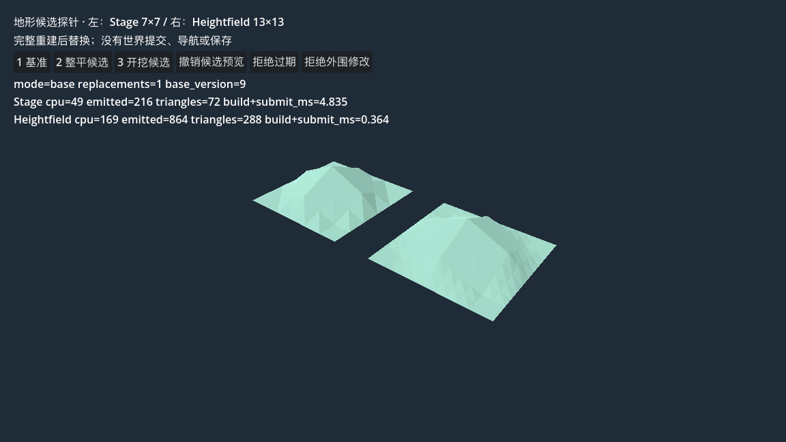
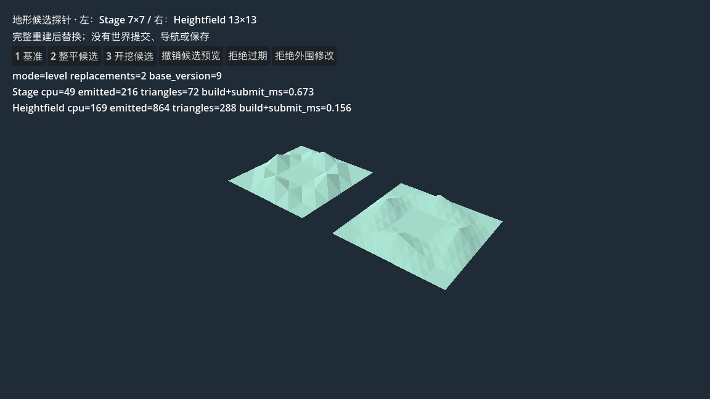
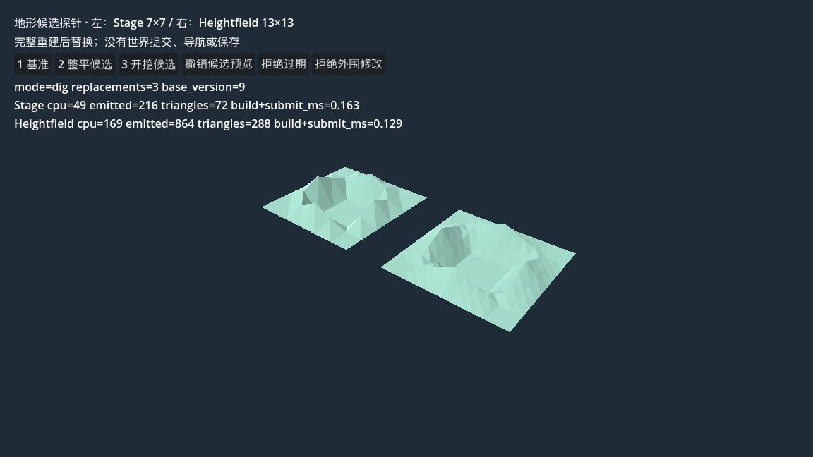

# 地形适配与候选预览复验

2026-10-04，起点main `0a1e54e`。T3-GODOT与T3-PROBE完成受限技术验收，reviewer与最终architect通过，等待PR集成；只接受ArrayMesh适配和独立的未提交候选显示，不关闭完整T3 [#6](https://github.com/liuyejinghong/yudian-game/issues/6)。执行子票[#24](https://github.com/liuyejinghong/yudian-game/issues/24)，[合同](../contracts/terrain-render-r1.md)，[证据与source SHA](../evidence/2026-10-04-terrain-render/verification.json)。

## 结果与证据

| 检查 | 实际结果 |
|---|---|
| 离线Debug构建 | 0警告/0错误；SDK10.0.401，Godot4.7.2，实际CLR10.0.12 |
| Adapter引擎检查 | 10命名项通过/exit0，含全部float顶点拒绝、展开顺序/平面法线、单surface/无index与材质、独立资源、真实最大两个生成器路径 |
| 主控独立检查 | 35条日志检查/exit0；真实反例先失败exit1、修复后拒绝；重复no-op、旧资源与临时资源释放、拒绝保留、30次切换、候选中心/角点读回、基准不变、退出清理 |
| 实际GUI | Metal4.0 Forward+ / Apple M3 Pro；冷重开base/count1；双击整平只到count2；键4/5真实过期/外围拒绝后仍level/count2；键3两次只到dig/count3；撤销预览回base/count4；Esc正常exit0 |
| 同镜头三态 | 当前审查构建实际PNG，1152×648，base/level/dig；均两算法同输入，并排位置固定 |
| 背面剔除 | 无UI、back-cull调试材质；top粉色141512像素，bottom0，图片已查看；不是双面掩盖 |
| 原工程保护 | main基线原有文件仅PLAN/root TODO/产研TODO授权更新；旧Main、CPU模块、旧fixture、项目/依赖和美术无改动 |

[构建](../evidence/2026-10-04-terrain-render/build.txt)、[适配器](../evidence/2026-10-04-terrain-render/adapter-run.txt)、[主控](../evidence/2026-10-04-terrain-render/probe-run.txt)、[GUI](../evidence/2026-10-04-terrain-render/gui-run.txt)、[截图运行](../evidence/2026-10-04-terrain-render/capture-run.txt)、[剔除运行](../evidence/2026-10-04-terrain-render/cull-run.txt)。UI只有按钮，空输入不适用；未建实际世界重载，冷重开只证明探针重新回基准。

## 审查、返工和运行澄清

GLM通过Agent Bridge ZCode原生确认GLM-5.3-Flash；`observed_model`未提供。首版`ac457be`→主控`833a7c2`；独立reviewer发现未引用CPU顶点float溢出漏检，主控在真实Godot复现exit1，再派一次限定返工`80b84d0`→主控`103f2eb`。修正版先转换全部顶点一次，三角引用缓存转换结果。补真实Stage257×257与Heightfield513×513最大合法路径，读回自动Tangent长度检查。最终reviewer未发现剩余功能/资源问题，两处MVID注释措辞由主控修正。

[主控原反例失败](../evidence/2026-10-04-terrain-render/pre-fix-independent-failure.txt)、[工人原金样失败](../evidence/2026-10-04-terrain-render/worker-golden-failure.txt)、[工人修复后运行](../evidence/2026-10-04-terrain-render/worker-run.txt)均保留。最早工人4项失败只存在会话输出，没有保存为原始日志；不补造。旧失败日志的SHA标签曾过度声称加载字节比对，现已修正。

冻结时低估两项实际引擎行为：Assembly.Location为空，现比对已加载MVID与当前Debug文件PE MVID，另记录文件SHA；这不是加载字节SHA比对。适配器只主动提供Vertex/Normal，但Godot自动生成Tangent，读回允许原生float数组且长度=展开顶点数×4，其他额外通道仍拒绝。这些由主控修订合同，未借工人自改放行。顺时针约定见[官方说明](https://docs.godotengine.org/en/stable/tutorials/3d/procedural_geometry/arraymesh.html)，最终上下表面图片提供实测证据。

最终构建文件SHA `B6396FAE…`、MVID `50d1d4a9…`用于headless和三态/剔除PNG。人工GUI对应其前一构建`49C26119…`，之后只修两处测试脚本注释措辞；适配器、探针逻辑、材质、场景未变。完整身份见verification.json和各日志，不混称一次运行。初次沙箱headless的系统证书/用户日志权限错误原样保留在失败日志；最后经授权运行及显式日志路径无ERROR，不隐藏错误。

Bridge首轮853秒、限定返工254秒；可见usage_update分别used78804/69625、size1000000，缓存读提示77.5k/68.5k，含义不明确，不求和当作计费token；价格/实际费用未知。工人代码仅授权三个目录；Bridge文件快照也包含主控同期文件，Git提交diff才是归属依据。

## 本轮边界与后续

7×7基准、内部9点整平/开挖，基准version9始终不变。Stage CPU49/展开216/72三角；Heightfield CPU169/展开864/288三角。更新采用完整CPU重建及两份全新ArrayMesh替换，flat法线与展开缓冲增加成本；计时只含CPU生成+资源提交，不含GPU完成，不能当稳定FPS或选型证据。

阶段管理、真正增量更新、邻区T-junction/法线接缝、世界提交、碰撞/导航、保存/重载、取消保留已发生结果、收益和正式美术均未实现。T3b/T3c父票及T3d/T3e继续留项。下一执行批次由主控冻结碰撞/局部更新等最小子票，再把确定适配与测试交GLM；图形效果最终美术确认仍由所有者承担，本报告不签美术效果。

最终architect只读复核：未发现阻碍受限交付的实质架构/残留问题，10/35检查与source/PNG哈希吻合，运行澄清和接受边界准确；主控接受T3-GODOT/T3-PROBE。
