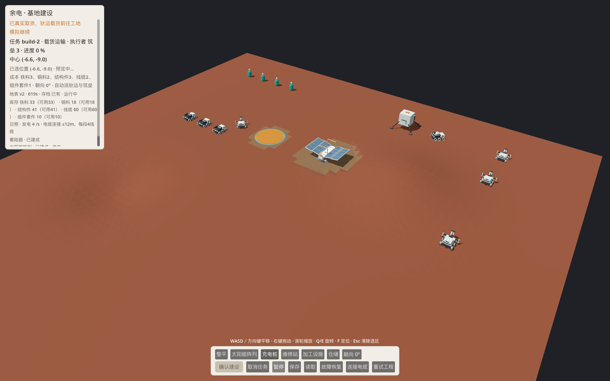

# D1.1 自举建设：工程实现与复验

2026-10-07。正式源码新档从着陆器、12台机器人和有限套件开始，真实运料、施工、付费接线、供电及充电维修已接入同一 Main。本批工程已独立复验；C02最终包的鼠标保存/重开仍因Mac锁屏待验，根「余电.app」继续指向D1.0。本报告不签完整D1.1联合出口、D1.2经营、G1或所有者视觉。

公开日志仅脱敏私人机器路径，原件私下保留；[脱敏说明](../evidence/2026-10-07-d11-bootstrap/README.md)及hash针对公开副本。

## 固定来源与应用

起点main718905d；导航GLM e68df8c/1f75fe9，UI GLM85dc0b6，权威规则/集成由Codex实现。最终运行源码为 `39309d27bfa89a954f383799c2c92e496fd57432`，后续仅证据/文档。两GLM均先在原生ZCode新会话确认GLM-5.3-Flash，再领独占文件；不以Bridge全目录扫描噪声代替Git提交范围。

新包 `<PROJECT_ROOT>/试玩包/D1.1 2026-10-07 r2/Yudian.app` 从该固定提交的空缓存目录导入，arm64/ad-hoc签名通过。Godot4.7.2、SDK10.0.401、TFMnet8.0；开发CLR10.0.12，导出自包含与实际九进程均CLR8.0.31。manifest如实dirty=true，仅生成未跟踪.uid/.import，tracked源码无差异；消费资源逐文件hash在[manifest](../evidence/2026-10-07-d11-bootstrap/build-manifest.json)。

PCK SHA256：`d06bb037604d4565e9e807fc6640cd93b5d44d1b0f4aa04a41a172c582e627f5`；源快照：`79701aa3b34844dd5bc97b0080d39325c88c0d63f4fd7e865ee4038f6586f7c2`。旧D1.0包、schema1档保留；本批schema2独立槽 `user://saves/d11-player-v2.json`，不自动迁移或自动保存。

## 行为与边界

- 五种设施共用真实选址、整平、驮运容量8的取卸货、筑垒工段和落成流程；首套保障/加工及三段线缆使用有限库存，落成登记能力。加工配方只登记，实际采集/加工生产留D1.2。
- 单活动建设或整平；库存、现场、cargo、spent、预约由同一离散账本管理。取消在途运输保货，重试先真实退货/继续；稳定操作ID不重复交接，预约不是消耗。无第二份在途库存。
- 有限网格路线消费真实MoveAndSlide，按体型、坡度、障碍及场地边界重验；地形/设施变化重算，实际停滞超过.6秒重算，120秒仍未到站停止。服务阻塞释放预约、保留工作/扣料/进度，既有重试入口重获路线与工位；阻塞档不自动发旧整平单。
- 实际位移与有效工段分别扣能耗/磨损；暂停/保存前结算上一物理帧，剩余预算限移动/工时，零电和零耐久停机。4/s日照出力、≤12m且每段4线缆付费连接；有限功率按服务顺序分配，夜间等待不补电。
- 维修消耗现场2结构件、有电累计8秒只恢复耐久；建筑另实运两次维修储备。充电3/s只恢复电量。保障保原工作/货物，实际返抵才恢复原工段；维修返程可衔接充电，返程取消停原回程，赴服务或服务中取消保独立保障。零值救援留D2。
- schema2保存新增全部事实；配置/几何/容器/守恒/操作/成本/阶段/健康/服务/目的地完整核对后，复用原地形全射线和实体物理屏障。损坏文件拒绝换世界，原有效档备份保留；恢复不重放取卸货或维修扣料。

## 实际证据

| 检查 | 结果与限制 |
|---|---|
| 账本/导航纯检查 | 14/78项通过；导航net8编译，主机纯检查显式CLR10运行，不伪称主机安装CLR8 |
| 最终source | r15零警告零错误；r9 full PASS，7座建成、两轮保障、真实围挡120秒阻塞/保存读取/撤障重试、整平续接与返程取消 |
| source跨进程 | r8九进程通过：全流＋取消载货/活动运输/已扣料维修/部分充电四种prepare-resume；其后Blocked加载订单修复由r9和最终包验证 |
| 最终同包 | 九独立进程全PASS、同一loaded MVID/hash、CLR8.0.31；覆盖上述四种中断和每个resume后续完整流程 |
| 界面/兼容 | source UI38项0失败，旧player五进程、LEVEL15、Main地形7、视觉适配12通过；最新保障修复仅bootstrap分支。导出包直接--script自测入口未完成，3分钟未启动测试后停止，退出原件含引擎清理错误；作为未完成入口留档，不计为通过 |
| source真实窗口 | CUA真实鼠标验证太阳能、重开读取、第二种充电设施运料/施工、付费电缆、暂停保存/关窗。附图为source GUI r2，明确不是最终包验收截图 |
| 最终包窗口 | Metal启动与首帧渲染已核；CUA因Mac锁屏无法连接。真实鼠标保存/关闭/重开 NOT_RUN，根入口尚未切换 |
| 独立审查 | reviewer与architect对39309d2均无剩余实质问题；审查只读，不代签实际GUI或所有者视觉 |

[九进程日志](../evidence/2026-10-07-d11-bootstrap/package-world-r2/runner.log) / [最终source](../evidence/2026-10-07-d11-bootstrap/native-r9.log) / [合同](../contracts/d11-bootstrap-r1.md) / [入口保护](../evidence/2026-10-07-d11-bootstrap/app-entry.json) / [证据hash](../evidence/2026-10-07-d11-bootstrap/evidence-sha256.json)。

早期native-r1夜间忽略充电目的地导致耗尽，r4零状态父子帧同步漏一帧；失败原件保留，修复后原要求通过，没有削弱断言。两轮保障用测试注入低健康触发，证明真实工作→保障→工作与独立成本/恢复，不证明自然耗损平衡或可持续经营。

## 待办

解锁后在39309d2同包完成实际鼠标保存/重开/继续，才能切根应用入口并收C02。A04/A05/A06联合表现、U01货舱局部修复和所有者视觉继续独立；美术PR43仍Draft/REWORK，不并入本批。真人理解/意愿、稳定联合性能、自然平衡、本地候选效果、D1.2生产/D2救援及发行均未接受。
