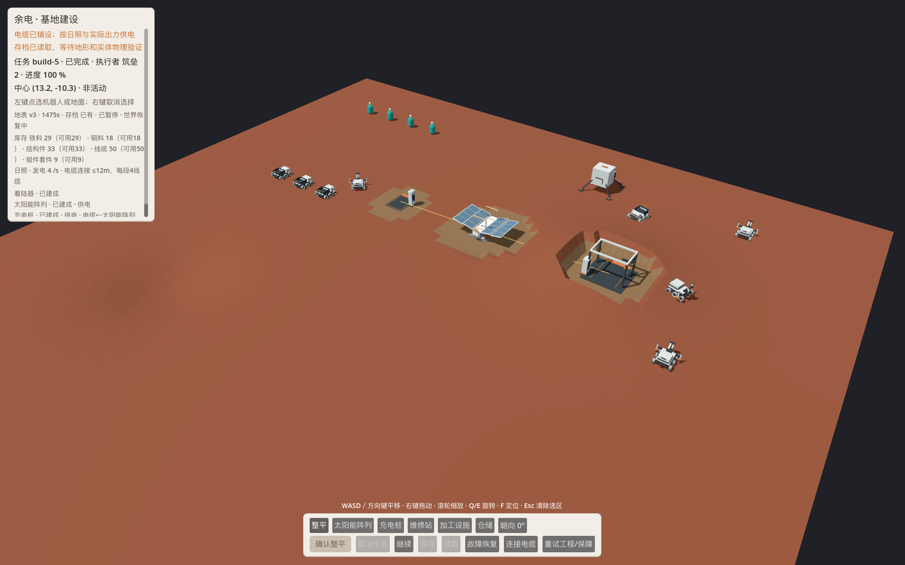

# D1.1 自举建设：工程实现与复验

2026-10-07。正式源码新档从着陆器、12台机器人和有限套件开始，真实运料、施工、付费接线、供电及充电维修已接入同一 Main。本批六工程子片已限定接受：最终包实际鼠标保存/关闭/重开/继续与正常根入口通过，「余电.app」已切D1.1 r3。完整模块继续IN_PROGRESS；本报告不签D1.2经营、G1或所有者视觉。

公开日志仅脱敏私人机器路径，原件私下保留；[本轮证据说明](../evidence/2026-10-07-d11-window-r3/README.md)及hash针对公开副本。真实存档不提交。先前39309d2/r2证据完整保留为历史。

## 固定来源与应用

起点main718905d；导航GLM e68df8c/1f75fe9，UI GLM85dc0b6，权威规则/集成由Codex实现。PR45实现源码为 `39309d27bfa89a954f383799c2c92e496fd57432`；解锁后实际窗口发现读档角点误拒绝，最终修复源码为 `975916deef138360114cc15c8e2fb28634c4c934`，其后仅证据/文档。两GLM均先在原生ZCode新会话确认GLM-5.3-Flash，再领独占文件；不以Bridge全目录扫描噪声代替Git提交范围。

当前包 `<PROJECT_ROOT>/试玩包/D1.1 2026-10-07 r3/Yudian.app` 从该固定提交的空缓存目录导入，arm64/ad-hoc签名通过。Godot4.7.2、SDK10.0.401、TFMnet8.0；开发CLR10.0.12，导出自包含与实际九进程均CLR8.0.31。manifest如实dirty=true，仅生成未跟踪.uid/.import，tracked源码无差异；消费资源逐文件hash在[manifest](../evidence/2026-10-07-d11-window-r3/build-manifest.json)。

PCK SHA256：`564d181f065cc131211e6ce033875bc208e74af0aa5a1b266f18e7a89a2405a5`；源快照：`5525f9fc93688e85376372d65be48d08c779611dc7a4254e142d9d63a3a0ae00`。旧D1.0包及备用入口、schema1档保留；原schema1/schema2文件在正常根入口验收前后字节hash相同；本批schema2独立槽 `user://saves/d11-player-v2.json`，不自动迁移或自动保存。

## 行为与边界

- 五种设施共用真实选址、整平、驮运容量8的取卸货、筑垒工段和落成流程；首套保障/加工及三段线缆使用有限库存，落成登记能力。加工配方只登记，实际采集/加工生产留D1.2。
- 单活动建设或整平；库存、现场、cargo、spent、预约由同一离散账本管理。取消在途运输保货，重试先真实退货/继续；稳定操作ID不重复交接，预约不是消耗。无第二份在途库存。
- 有限网格路线消费真实MoveAndSlide，按体型、坡度、障碍及场地边界重验；地形/设施变化重算，实际停滞超过.6秒重算，120秒仍未到站停止。服务阻塞释放预约、保留工作/扣料/进度，既有重试入口重获路线与工位；阻塞档不自动发旧整平单。
- 实际位移与有效工段分别扣能耗/磨损；暂停/保存前结算上一物理帧，剩余预算限移动/工时，零电和零耐久停机。4/s日照出力、≤12m且每段4线缆付费连接；有限功率按服务顺序分配，夜间等待不补电。
- 维修消耗现场2结构件、有电累计8秒只恢复耐久；建筑另实运两次维修储备。充电3/s只恢复电量。保障保原工作/货物，实际返抵才恢复原工段；维修返程可衔接充电，返程取消停原回程，赴服务或服务中取消保独立保障。零值救援留D2。
- schema2保存新增全部事实；配置/几何/容器/守恒/操作/成本/阶段/健康/服务/目的地完整核对后，复用原地形全射线和实体物理屏障。损坏文件拒绝换世界，原有效档备份保留；恢复不重放取卸货或维修扣料。

## 实际证据

| 检查 | 结果与限制 |
|---|---|
| 账本/导航纯检查 | 14/78项通过；导航net8编译，主机纯检查显式CLR10运行，不伪称主机安装CLR8 |
| 最终source | 角点修复编译零警告零错误；full PASS，7座建成、两轮保障、真实围挡120秒阻塞/保存读取/撤障重试、整平续接与返程取消；同一真实档replay及禁用碰撞体反例通过 |
| source跨进程 | r8九进程通过：全流＋取消载货/活动运输/已扣料维修/部分充电四种prepare-resume；其后Blocked加载订单修复由r9和最终包验证 |
| 最终同包 | r3九独立进程全PASS、同一loaded MVID/hash、CLR8.0.31；覆盖四种中断和每个resume后续完整流程；真实失败档replay也通过 |
| 界面/兼容 | 此前source UI38/视觉12通过；975916d修复后旧player五进程、LEVEL15、Main地形7再次通过。Main7第一次漏历史入口参数导致失败，补正确--live-terrain后通过，原件保留。导出包直接--script自测入口未完成，3分钟未启动测试后停止，退出原件含引擎清理错误；作为未完成入口留档，不计为通过 |
| source真实窗口 | CUA真实鼠标验证太阳能、重开读取、第二种充电设施运料/施工、付费电缆、暂停保存/关窗。附图为source GUI r2，明确不是最终包验收截图 |
| 最终包窗口 | r2鼠标实建维修站/运接线料/保存，关窗重开真实暴露角点误拒绝；r3同档鼠标读取/继续接线/保存/关窗重开完成态通过，库存不重复扣；正常根入口启动及读原schema2通过 |
| 独立审查 | reviewer对975916d修复及最终49份公开证据复核无实质问题；architect复核身份/范围，两处旧入口说明已修正。审查只读，不代签所有者视觉 |

[九进程日志](../evidence/2026-10-07-d11-window-r3/package-world/runner.log) / [最终source](../evidence/2026-10-07-d11-window-r3/source-full.log) / [合同](../contracts/d11-bootstrap-r1.md) / [入口与存档保护](../evidence/2026-10-07-d11-window-r3/app-entry.json) / [证据hash](../evidence/2026-10-07-d11-window-r3/evidence-sha256.json) / [r2历史证据](../evidence/2026-10-07-d11-bootstrap/README.md)。

早期native-r1夜间忽略充电目的地导致耗尽，r4零状态父子帧同步漏一帧；失败原件保留，修复后原要求通过，没有削弱断言。两轮保障用测试注入低健康触发，证明真实工作→保障→工作与独立成本/恢复，不证明自然耗损平衡或可持续经营。

## 本次真实失败与修复

r2实际鼠标在维修站(13.2,-10.3)建成后运4线缆，卸货后回着陆器Pickup阶段暂停保存：地形v3、t1441.433，库存铁29/铜18/结构件33/线缆50/套件9。关窗重开时(-30,30)边缘射线无命中，加载正确回滚并保留原档，但玩家不能续接。

同一私有测试档建立[失败replay](../evidence/2026-10-07-d11-window-r3/replay-red.log)。诊断证实垂直射线span变化使恰在外网格边界的命中不稳定；同span微移内点和另一span仍命中当前真实碰撞体。只将验证采样的外边界向场内移0.001个cell，预期高度复用已有同三角插值；mesh/shape一致、全4225条真实射线和0.0001m容差保留，没有CPU高度兜底。临时诊断已删除；故意禁用碰撞体仍拒绝。

r3加载同档保持时间/暂停/阶段/物料；真实鼠标继续后电缆完成、维修站获供电，库存仍29/18/33/50/9。再暂停保存t1474.6、关闭重开读取完成态通过；两次关窗进程exit0。最后从根应用正常启动，读取原有太阳能完成档t580.333、保持暂停，关窗未保存；两份原存档字节不变。根入口以原生应用路径打开，本轮未另做访达双击手势。[source绿检查](../evidence/2026-10-07-d11-window-r3/replay-source-green.log) / [同包绿检查](../evidence/2026-10-07-d11-window-r3/replay-package-green.log) / [正常入口日志](../evidence/2026-10-07-d11-window-r3/default-entry.log)。

## 留项与下一批

六工程子片的ACCEPTED限定于当前合同与上述证据；完整模块继续IN_PROGRESS。下一检查点为D1.2缺料时真实采集/运输/加工/建设/保障与有不同后果的发展选择；E14本地候选合同准备仍需独立冻结，不据这次验收宣布模型效果。

A04/A05/A06联合表现、U01货舱局部修复和所有者视觉继续美术独立会话；PR43/44仍Draft，不并入本批。真人理解/意愿、稳定联合性能、自然平衡、本地候选效果、D2救援及发行均未接受。
